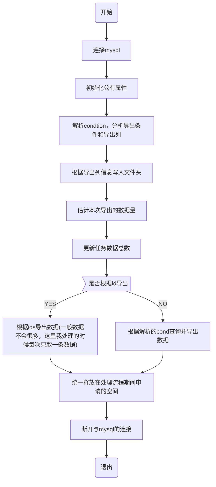
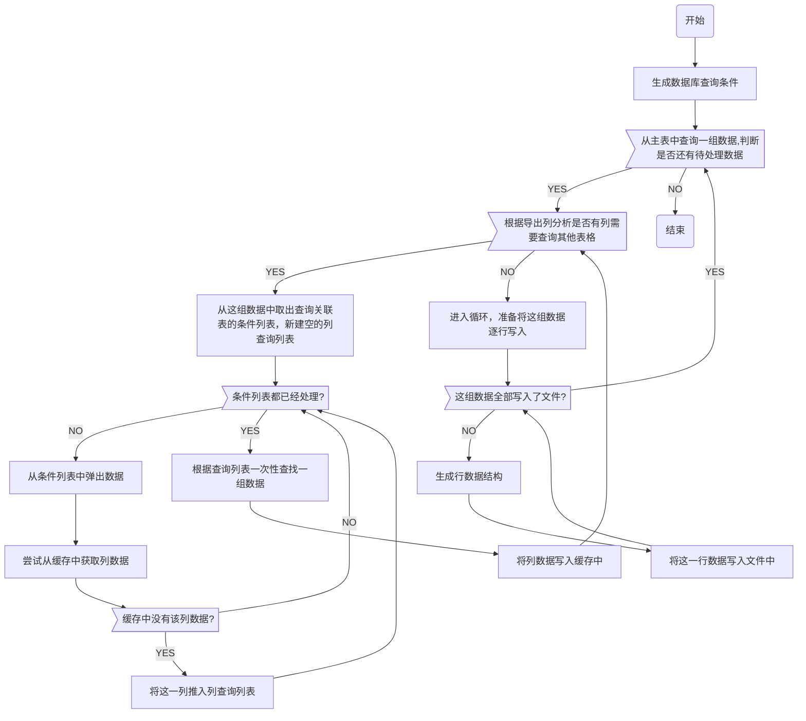
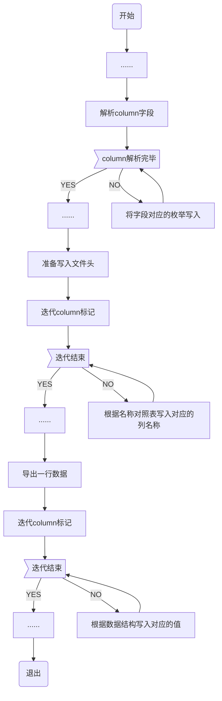
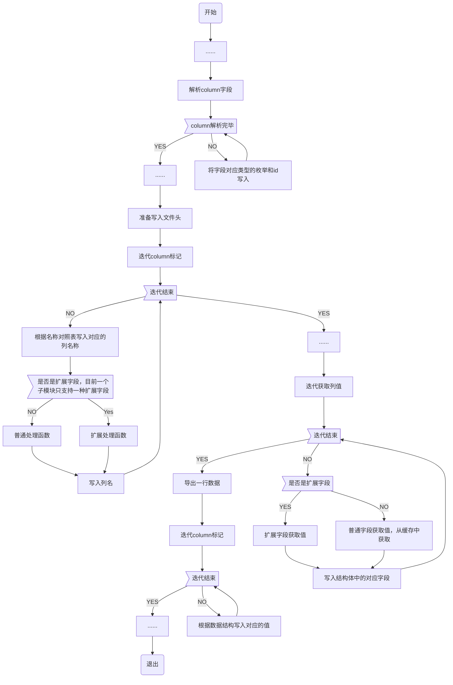
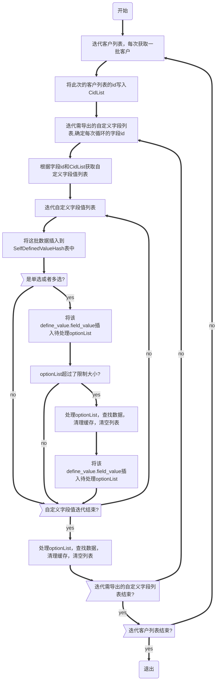

# 导出模块化设计及导出性能优化

## 1 导出模块化设计

### 1.1 导出模块主要文件

PSServiceWorkProcessExportModule.h

PSServiceWorkProcessExportModule.c

### 1.2 导出模块实例化示例

#### 1.2.1 主模块

##### 1.2.1.1 为主模块新建主模块文件

例：

PSServiceWorkProcessCRMCustomer.c

PSServiceWorkProcessCRMCustomer.h

##### 1.2.1.2 主模块类型应以web的展示列表为基准，一个展示列表一个主模块类型

例：


##### 1.2.1.3 主模块代码除对应的子模块的处理分支完全一致

```c
int PSServiceWorkProcessPreviewCall(PSSInternalData *intData)
{
    PSSCoreData *pCoreData = PSSCoreDataGet();
    int sub_module_type = -1, ret = -1;
    EMICALL_DB_CM_ASYNC_TASK *taskData = NULL;
    CmAsyncTask_REQUEST_PARAM reqParam;
    CmAsyncTask_RESPONSE_DATA rspData;
    int index = Get_DB_Index_Quick();

    memset(&rspData, 0x0, sizeof(CmAsyncTask_RESPONSE_DATA));
    memset(&reqParam, 0x0, sizeof(CmAsyncTask_REQUEST_PARAM));
    reqParam.actionType = DB_ACCESS_ACTION_CM_ASYNC_TASK_GET_BY_ID;
    reqParam.requestParam.GetById.seid = intData->seid;
    reqParam.requestParam.GetById.ccgeid = intData->ccgeid;
    reqParam.requestParam.GetById.id = intData->task_id;

    // 获取数据库表async_task
    ret = DbChannelCmAsyncTask(index, &reqParam, &rspData);
    if( 0 != ret )
    {
        EmicCmLog(LOG_LEVEL_DEBUG,__FUNCTION__,"ccgeid=%lu moduleType=%d, get asyncTask table failed.", 
                  intData->ccgeid, intData->moduleType); 
        return ret;
    }

    taskData = &(rspData.respData.GetData);

    sub_module_type = taskData->sub_module_id;

    EmicCmLog(LOG_LEVEL_DEBUG,__FUNCTION__,"ccgeid=%lu moduleType=%d, sub_module_type=%d, %s,%s,condition:%s work process seat...", 
              intData->ccgeid, intData->moduleType, taskData->sub_module_id, taskData->file_path,  taskData->err_result_file,
              taskData->condition);

    /*子模块处理分支
    switch(sub_module_type)
    {
        case PSS_SUB_MODULE_TYPE_Preview_Call_Detail_Import:
            ret = PSServiceWorkProcess_Import( intData, taskData, FALSE);
            break;
        case PSS_SUB_MODULE_TYPE_Preview_Call_Detail_Export:
            ret = PSServiceWorkProcessPreviewCallDetail_Export(taskData);
            break;
        case PSS_SUB_MODULE_TYPE_Preview_Call_Export:
            ret = PSServiceWorkProcessPreviewCall_Export(taskData);
            break;
        case PSS_SUB_MODULE_TYPE_P_Statistics_CM_Result_Export:
            ret = PSServiceWorkProcessPStatisticsCMResult_Export(taskData);
            break;
        case PSS_SUB_MODULE_TYPE_P_Statistics_Seat_Export:
            ret = PSServiceWorkProcessPSeatStatis_Export(taskData);
            break;
        case PSS_SUB_MODULE_TYPE_p_Statistics_Group_Export:
            ret = PSServiceWorkProcessPGroupStatis_Export(taskData);
            break;
        case PSS_SUB_MODULE_TYPE_P_Statistics_Call_Result_Export:
            ret = PSServiceWorkProcessPCallResultStatis_Export(taskData);
            break;
        case PSS_SUB_MODULE_TYPE_Preview_Call_BATCH_Export:
            ret = PSServiceWorkProcessPreviewCallBatch_Export(taskData);
            break;
    }
 	*/
    return ret;
}
```

#### 1.2.1 子模块

在开发过程中，发现导出子模块的操作具有相似性，于是希望创建一个导出类将重复的操作进行封装，只对外暴露特殊化的属性以供不同的子模块操作实例化。

##### 1.2.1.1 子模块属性

分为两部分：

1、子模块执行中所需的静态或者动态属性

2、子模块的执行动作

```c
typedef struct __pss_export_header__
{
    PSS_EXPORT_CONTROL_HEADER control_header;	//属性
    PSS_EXPORT_CALLBACK callback;				//动作
}PSS_EXPORT_HEADER;
```

```c
typedef struct __pss_export_control_header__
{
    unsigned long seid;
    unsigned long ccgeid;
    unsigned long async_task_id;
    
    PSSExportColumnMask *o_mark;   //顺序标识
    int o_mark_len;    //顺序标识的个数
    const fieldData *header_list;   //文件头对照表
    
    MYSQL                                 *db_conn;
    
    PSSExportFileData *fileData;    //导出文件信息
    
    /* 查询条件 */
    char          *ids;
    void *condition;
    unsigned long    estimated_count;   //这次导出任务的估计值
    unsigned long    last_handle_id; //作为condition偏移量，初始化为0
    int    last_handle_count;  //判断何时可以终止循环

    char *cache;        //缓冲区，在本次导出任务中分配，对于那些希望在导出中过程中缓存数据的任务来说，这是有用的
}PSS_EXPORT_CONTROL_HEADER;
```

```c
typedef struct __pss_export_callback__
{
    PSServiceExportParseCondionAndColumn parse_func;    //解析参数，更新o_mark，o_mark_len，condition
    PSServiceExportConfirmTotalCountOfTask count_func;  //实现导出数量预估函数，更新estimated_count
    PSServiceExportInfoByIdsfunc ids_func;              //实现id迭代函数的单词获取
    PSServiceExportInfoByCondition condition_func;      //实现条件迭代函数的单次获取，更新last_handle_count和last_handle_id
    PSServiceExportHeaderExpandFunc ex_col_text_func;   //扩展处理函数,获取扩展列名称
    PSServiceExportFreeConditionContent free_func;      //内存释放函数，释放condition指向的实例化结构中分配的空间
    
    PSSExportType expand_type;   //扩展处理类型
}PSS_EXPORT_CALLBACK;
```

##### 1.2.1.2 子模块实例化

将子模块处理类实例化为对应的处理对象，然后开始让子模块对象开始执行。

```c
static int PSServiceWorkProcessCRMCustomer_Export(
    EMICALL_DB_CM_ASYNC_TASK *pTaskData
    )
{
    if(pTaskData == NULL)
    {
        return -1;
    }
    int  ret = 0;

    PSS_EXPORT_HEADER *header = NULL;
    header = PSServiceExportCommonHandlerNew();
    
    PSServiceExportCRMControlHeaderInit(header);
    
    PSSExportCommonFuncStart(pTaskData, header);
    
    PSSExportCommonFree(header);
    
    return 0;
}
```

PSServiceExportCRMControlHeaderInit(header)属性初始化函数，不同的子模块需要具体实现。

```c
static PSS_EXPORT_HEADER *PSServiceExportCRMControlHeaderInit(PSS_EXPORT_HEADER *header)
{
    header->callback.ex_col_text_func = &PSServiceHeaderExpandFuncCRM;
    header->callback.expand_type = PSSExportTypeCRMCustomerDefined;

    header->control_header.header_list = CRMCustomerFields;
    header->callback.count_func = &PSServiceExportCRMCountTaskTotalNum;
    header->callback.parse_func = &CRMCustomerExportParseConditionAndColumn;
    header->callback.ids_func = &PSServiceExportCRMCustomerByIds;
    header->callback.condition_func = &PSServiceExportCRMByCondition;
    header->callback.free_func = &PSServiceExportCRMFreeConditionContent;
    return header;
}
```

##### 1.2.1.3 子模块处理流程图

###### 1.2.1.3.1 主流程

（数据获取和导出流程(ids和cond基本一致，考虑以后会将两者合并提升ids的效率）




###### 1.2.1.3.2 导出处理流程

(不同的导出处理大相径庭，这里只是列举典型的导出CRM客户的处理流程。这意味着在导出处理中我们无法进行代码复用，而是需要特殊化处理，拷贝代码然后修改特殊化的字段)



###### 1.2.1.3.3 另外需要注意的是两种处理技巧，一个是列的顺序标识，一个是扩展处理函数的使用。

1. 列的顺序

```c
    PSSExportColumnMask *o_mark;   //顺序标识
    int o_mark_len;    //顺序标识的个数
    const fieldData *header_list;   //文件头对照表
```

```c
typedef struct __pss_export_column_mask__ {
    int sort_index;
    
    int id_by_type; //根据id和索引sort_index来确定列顺序
    
    PSSExportType type;
    
    int sub_type;   //扩展字段目前用于自定义字段类型
    //0-文本,1-数值,2-日期,3-单选框,4-复选框,5-下拉列表
} PSSExportColumnMask;
```

```c
typedef enum
{
    PSSExportTypePreviewCallDetail,
    PSSExportTypePreviewCall,
    PSSExportTypeCRMCustomerFixed,
    PSSExportTypePSeatStatis,
    PSSExportTypePGroupStatis,
    PSSExportTypePStatisticsCMResult,
    PSSExportTypePStatisticsCallResult,
    PSSExportTypePreviewCallBatch,

    //expand type
    PSSExportTypeDefinedStart,
    PSSExportTypeCRMCustomerDefined
}PSSExportType;
```

列的顺序由PSS_EXPORT_CONTROL_HEADER中的这三个字段决定，解析cm的列字段后，我们可以确定导出列的顺序。顺序有两处用到，一是文件头信息，一个是导出每行数据的时候。在流程开始前，需要新建子模块特有的数据结构，列枚举和列名称对照表。

```c
typedef enum
{
    CRMCustomerExportCmName,
    CRMCustomerExportCmTel,
    CRMCustomerExportHomeTel,
    CRMCustomerExportCopTel,
    CRMCustomerExportCmGender,
    CRMCustomerExportCmEmail,
    CRMCustomerExportCmCopAddress,
    CRMCustomerExportCmCopName,
    CRMCustomerExportCmWebsite,
    CRMCustomerExportCmDetail,
    CRMCustomerExportModifyTime
}CRMCustomerExportColumnMarkOrder;
```

```c
static const fieldData CRMCustomerFields[] = {
	{ CRMCustomerExportCmName,	            "客户姓名" },
	{ CRMCustomerExportCmTel,	            "客户号码" },
    { CRMCustomerExportHomeTel,               "家庭号码" },
    { CRMCustomerExportCopTel,               "公司号码" },
    { CRMCustomerExportCmGender,               "性别" },
    { CRMCustomerExportCmEmail,               "邮箱" },
    { CRMCustomerExportCmCopAddress,               "公司地址" },
    { CRMCustomerExportCmCopName,               "公司名称" },
    { CRMCustomerExportCmWebsite,               "网址" },
    { CRMCustomerExportCmDetail,               "客户描述" },
    { CRMCustomerExportModifyTime,               "最后编辑时间" },
};
	
```



2. 自定义扩展字段

在CRM功能中新增了自定义字段功能，目前实现了一种可扩展的自定义处理机制

在新增扩展字段时(以自定义字段为例)，我们需要进行如下操作

```c
typedef enum
{
    PSSExportTypePreviewCallDetail,
    PSSExportTypePreviewCall,
    PSSExportTypeCRMCustomerFixed,
    PSSExportTypePSeatStatis,
    PSSExportTypePGroupStatis,
    PSSExportTypePStatisticsCMResult,
    PSSExportTypePStatisticsCallResult,
    PSSExportTypePreviewCallBatch,

    //expand type
    PSSExportTypeDefinedStart = 100,
    PSSExportTypeCRMCustomerDefined
}PSSExportType;
```

- 在枚举中新增PSSExportTypeCRMCustomerDefined枚举类型

```c
static PSS_EXPORT_HEADER *PSServiceExportCRMControlHeaderInit(PSS_EXPORT_HEADER *header)
{
    header->callback.ex_col_text_func = &PSServiceHeaderExpandFuncCRM;
    header->callback.expand_type = PSSExportTypeCRMCustomerDefined;

    header->control_header.header_list = CRMCustomerFields;
    header->callback.count_func = &PSServiceExportCRMCountTaskTotalNum;
    header->callback.parse_func = &CRMCustomerExportParseConditionAndColumn;
    header->callback.ids_func = &PSServiceExportCRMCustomerByIds;
    header->callback.condition_func = &PSServiceExportCRMByCondition;
    header->callback.free_func = &PSServiceExportCRMFreeConditionContent;
    return header;
}
```

- 在初始化特有属性时指定    header->callback.expand_type = PSSExportTypeCRMCustomerDefined;

- 指定自定义字段处理函数     header->callback.ex_col_text_func = &PSServiceHeaderExpandFuncCRM;

```c
#define EXPORT_COL_DEFINEED_MARK  "defineField_"
```

-  设定自定义字段鉴别标识     #define EXPORT_COL_DEFINEED_MARK  "defineField_"

- 实现自定义字段值获取函数    目前自定义字段的处理放在每列数据导出的时候，暂时没有更好的办法



## 2 导出性能优化

本次性能优化将通过缓存和集中获取数据以减少数据库的访问

见文档第[1.2.1.3.2](#1.2.1.3.2 导出处理流程)节

###  2.1 客户信息导出

和cid有关，优化只能通过联表查询

#### 2.1.1 缓存设计

暂时使用hashtable

和预览式外呼任务详情导出不同，每个客户信息相互独立，可能导致导出客户过程中产生巨大的缓存数据量。这里只需要缓存功能，只在导出的一个循环中存在。

但是句柄可以存在于整个导出过程中。

客户号码的缓存自不必说，和下面的预览式外呼任务详情缓存一样。

新增缓存的申请和释放回调

```c
static PSS_EXPORT_HEADER *PSServiceExportCRMControlHeaderInit(PSS_EXPORT_HEADER *header)
{
    header->callback.ex_col_text_func = &PSServiceHeaderExpandFuncCRM;
    header->callback.expand_type = PSSExportTypeCRMCustomerDefined;

    header->control_header.header_list = CRMCustomerFields;
    header->callback.count_func = &PSServiceExportCRMCountTaskTotalNum;
    header->callback.parse_func = &CRMCustomerExportParseConditionAndColumn;
    //header->callback.ids_func = &PSServiceExportCRMCustomerByIds;
    header->callback.init_cache_func = &PSServiceExportCRMInitCache;
    header->callback.free_cache_func = &PSServiceExportCRMFreeCache;
    header->callback.condition_func = &PSServiceExportCRMByCondition;
    header->callback.free_func = &PSServiceExportCRMFreeConditionContent;
    return header;
}
```


下面是自定义字段的缓存流程图，自定义字段有可能横跨三张表，所以对这类字段需要单独进行优化。



#### 2.1.2 补充消息批量获取

### 2.2 预览式外呼任务详情导出

#### 2.2.1 缓存设计

暂时使用hashtable

和客户导出不同，这里缓存的信息不是相互独立的，hashtable有去重和缓存的功能，将在整个导出过程中存在。

#### 2.2.2 补充消息批量获取

##### 2.2.2.1 PreviewCallDetailExportSeatName

根据主表中获取的uid生成uid列表，批量获取并存入数据结构对应的字段中

##### 2.2.2.2 PreviewCallDetailExportEnterpriseName

根据主表中获取的ccgeid生成ccgeid列表，批量获取并存入数据结构对应的字段中

##### 2.2.2.3 PreviewCallDetailExportGroupName

根据主表中获取的gid生成gid列表，批量获取并存入数据结构对应的字段中

### 2.3 预览式外呼任务导出

没有关联信息需要单独获取，不需要优化

### 2.4 预览式外呼话后处理结果导出

没有关联信息需要单独获取，不需要优化

### 2.5 预览式外呼坐席统计导出

没有关联信息需要单独获取，不需要优化

### 2.6 预览式外呼技能组统计导出

没有关联信息需要单独获取，不需要优化

### 2.7 预览式外呼结果导出

没有关联信息需要单独获取，不需要优化

### 2.8 预览式外呼批次导出导出

没有关联信息需要单独获取，不需要优化

# 3 uthash的封装

以seatname的封装为例：

UTHashLib.c

```c
#include "UTHashLib.h"

/*init common hash table and return handler*/
CommonHashHandler *InitCommonUTHashTable(){
    CommonHashHandler *handler = NULL;
    handler = EmicMalloc(sizeof(*handler));
    *handler = NULL;
    return handler;
}

/*add element to hashtable*/
void AddCommonInfoIntoUTHashTable(CommonHashHandler *handler, char *key, char *valueStr){
    if(handler == NULL || key == NULL || valueStr == NULL){
        EmicCmLog(LOG_LEVEL_ERROR, __FUNCTION__, "AddCRMTelInfoIntoUTHashTable argument error");
        return;
    }
    CommonHashElement s = NULL;
    s = EmicMalloc(sizeof(*s));
    memset(s, 0, sizeof(*s));
    Emic_strncpy(s->key, key, sizeof(s->key));
    int valueSize = strlen(valueStr) + 1;
    while(TRUE){
        if(s->valueSize == 0){
            s->valueSize = INIT_COMMON_UTHASH_VALUE_SIZE * sizeof(*(s->valueStr));
            
            s->valueStr = EmicMalloc(s->valueSize);
        }else if(s->valueSize < valueSize){
            s->valueSize *= 2;
            s->valueStr = EmicRealloc(s->valueStr, s->valueSize);
        }else{
            break;
        }
    }
    Emic_strncpy(s->valueStr, valueStr, s->valueSize);
    HASH_ADD_STR(*handler, key, s);
    
}


/*get element info from hashtable*/
const char *GetCommonInfoFromUTHashTable(CommonHashHandler *handler, char *key){
    if(handler == NULL || key == NULL){
        EmicCmLog(LOG_LEVEL_ERROR, __FUNCTION__, "GetCRMTelInfoFromUTHashTable argument error");
        return NULL;
    }
    
    CommonHashElement s = NULL;
    HASH_FIND_STR(*handler, key, s);
    if(s != NULL){
        return s->valueStr;
    }else{
        return NULL;
    }
} 

/*delete elements*/
void DeleteAllFromCommonUTHashTable(CommonHashHandler *handler){
    if(handler == NULL){
        EmicCmLog(LOG_LEVEL_ERROR, __FUNCTION__, "DeleteAllFromCRMTelUTHashTable argument error");
        return;
    }
    CommonHashElement current, tmp;
    
    HASH_ITER(hh, *handler, current, tmp) {
      HASH_DEL(*handler, current);
      FREE_IF_NOT_NULL(current->valueStr);
      FREE_IF_NOT_NULL(current);
    }
}

void RemoveCommonUTHashTable(CommonHashHandler *handler){
    if(handler != NULL){
        DeleteAllFromCommonUTHashTable(handler);
    }
    FREE_IF_NOT_NULL(handler);
}

```

UTHashLib.h

```c
#include "uthash.h"

#define COMMON_UTHASH_ID_MAX_LEN 64
#define INIT_COMMON_UTHASH_VALUE_SIZE 64
typedef struct _CommonUTHash_ *CommonHashHandler;
typedef struct _CommonUTHash_ *CommonHashElement;
struct _CommonUTHash_{
    char                        key[COMMON_UTHASH_ID_MAX_LEN];
    char                        *valueStr;
    int                         valueSize;
    UT_hash_handle              hh;
};

CommonHashHandler *InitCommonUTHashTable();
void AddCommonInfoIntoUTHashTable(CommonHashHandler *obj, char *key, char *valueStr);
const char *GetCommonInfoFromUTHashTable(CommonHashHandler *handler, char *key);
void DeleteAllFromCommonUTHashTable(CommonHashHandler *obj);
void RemoveCommonUTHashTable(CommonHashHandler *handler);

```

# 4 ids和cond的合并

过去将根据id导出和根据条件导出分开写，这样开发效率是比较低的，并且一旦有地方修改很有可能只改ids或者cond而忘记另一个。现将ids和cond合并，走cond逻辑即将ids封装成数据库的筛选语句。