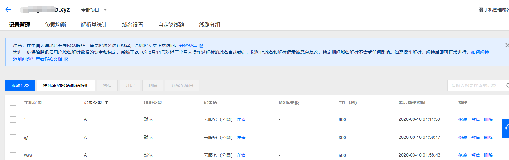
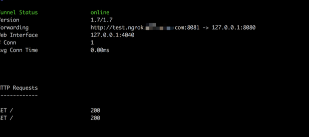

# 使用ngrok进行内网穿透

https://www.jianshu.com/p/53c72ae1446c

参考此文档部署ngrok服务

## 前言


## 实践

### 自建ngrok服务

#### 下载源码

```shell
git clone https://github.com/inconshreveable/ngrok.git
```

#### 编译

```shell
cd ngrok
make
```

#### 部署(Docker容器部署)

- 条件

部署ngrok需要:

1. 具备独立ip的服务器，这里我使用的是腾讯云
2. 配置域名(注意解析方式)



- 编译服务器

这里采用docker容器方式实现

创建dockerFile如下：

```dockerfile
FROM golang:1.7.1-alpine
ADD build.sh /
RUN apk add --no-cache git make openssl
RUN git clone https://github.com/inconshreveable/ngrok.git --depth=1 /ngrok
RUN sed -i "109,109s/tcp/tcp4/g" /ngrok/src/ngrok/server/tunnel.go
RUN sed -i  "57,57s/tcp/tcp4/g" /ngrok/src/ngrok/conn/conn.go
RUN sh /build.sh
EXPOSE 8081
VOLUME [ "/ngrok" ]
CMD [ "/ngrok/bin/ngrokd"]
```

build.sh内容如下：

```shell
export NGROK_DOMAIN="ngrok.xxxx.com"
cd /ngrok/
openssl genrsa -out rootCA.key 2048
openssl req -x509 -new -nodes -key rootCA.key -subj "/CN=$NGROK_DOMAIN" -days 5000 -out rootCA.pem
openssl genrsa -out device.key 2048
openssl req -new -key device.key -subj "/CN=$NGROK_DOMAIN" -out device.csr
openssl x509 -req -in device.csr -CA rootCA.pem -CAkey rootCA.key -CAcreateserial -out device.crt -days 5000
cp rootCA.pem assets/client/tls/ngrokroot.crt
cp device.crt assets/server/tls/snakeoil.crt
cp device.key assets/server/tls/snakeoil.key

make release-server
GOOS=linux GOARCH=386 make release-client
GOOS=linux GOARCH=amd64 make release-client
GOOS=windows GOARCH=386 make release-client
GOOS=windows GOARCH=amd64 make release-client
GOOS=darwin GOARCH=386 make release-client
GOOS=darwin GOARCH=amd64 make release-client
GOOS=linux GOARCH=arm make release-client
```

注：这里把ngrok.xxxx.com替换为自己的域名

- 构建镜像

```shell
docker build -t ngrok .
```

- 启动容器

```shell
docker run -it  -p 8082:8082 -p 4443:4443 -p 80:80  -d ngrok /ngrok/bin/ngrokd -domain="ngrok.xxxx.com" -httpAddr=":80"
```

注：这里把ngrok.xxxx.com替换为自己的域名

### 客户端部署

客户端即内网服务器需要向服务器端注册才能接收到服务器的转发数据

#### 编译

与服务端的编译方式相同

#### 运行

```shell
cd bin
```

- 创建配置文件

```shell
vi config.yml
```

```yml
server_addr: "ngrok.xxxx.com:4443"
trust_host_root_certs: false
tunnels:
    ssh:
       remote_port: 8082
       proto:
         tcp: 8082
    web:
     remote_port: 80
     subdomain: "kai-sa"
     proto:
       http: 80
```

注：这里把ngrok.xxxx.com替换为自己的域名

- 启动客户端

```shell
./ngrok  -config=config.yml start-all
```

- 访问内网

启动后会显示



forwarding中有我们请求协议中的host信息