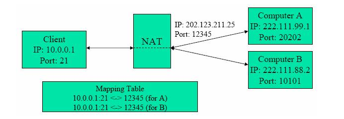
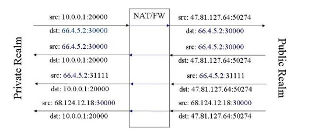
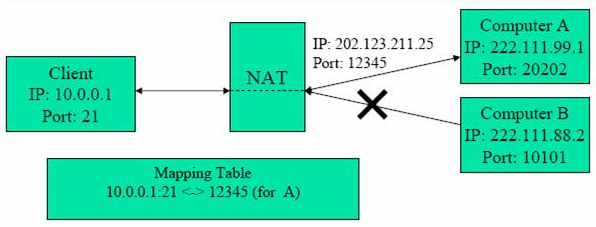
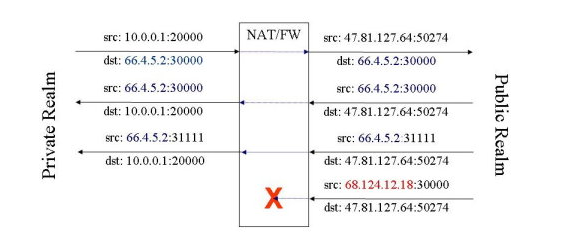
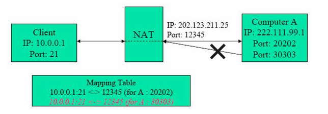
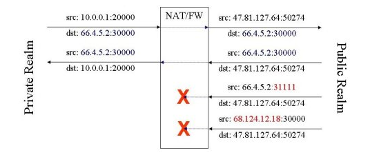
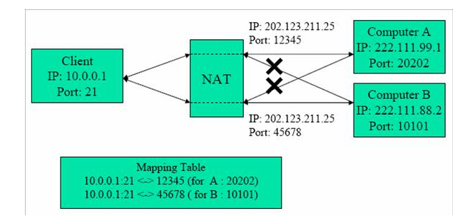
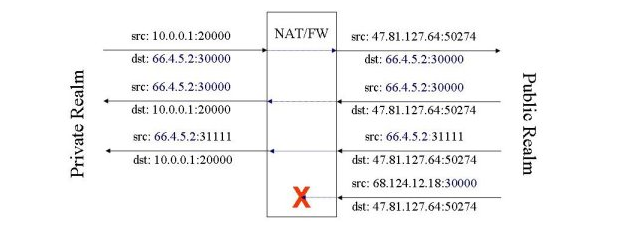
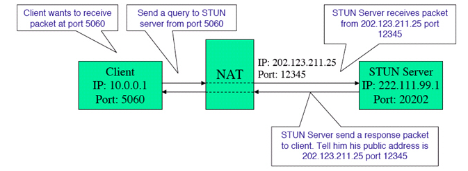
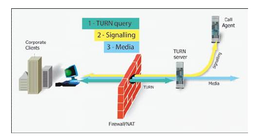

# 穿越防火墙技术
背景：voip在刚推出的初期，收到各种因素的干扰，以致于非常难用。一个很大的限制是，收话发话的两端都必须填入所用电脑的ip地址才能让双方互联。对于在防火墙后面的使用者而言，只是一项难以达成的任务，无论使用者或电脑都难以轻易获知其对外的ip地址。这种现象一直等到skype推出之后才获得大幅改善，大大提高了voip的可用度。即使使用者是在防火墙之后，voip也可以顺利运作，这要归功于“voip穿越nat防火墙技术”
## 1 nat和防火墙的来源
nat是一种将内部ip和外部ip相互转换的计数。起源是因为ipv4地址逐渐稀少，而很多企业或者网络公司在拥有少数ip地址而公司内部拥有太多电脑时而采用共用ip的解决方法，让一个ip地址给多个电脑使用。通常nat是将每一步电脑所用的(ip，port number)，本文称为内部地址，对应到(共用ip，port number)，本文称为外部地址，而nat负责将进出封包的表头进行转换使得内部电脑可以和外部网络通信。
企业使用防火请对网络进行管控是很自然的事，通常有三项主要的功能：

- 存取控制(Access Control)
- 身份识别(Authentication)
- 安全稽核
常用的私有ip地址是
- 10.0.0.0/8
- 172.16.0.0-172.31.0.0
- 192.168.0.0/24
nat与防火墙对于voip的通话造成很大的困扰，逼得voip研究人员发展出一套很复杂的计数让voip能穿越防火墙，让在防火墙后面的使用者能自由的使用voip
## 2 防火墙/nat的种类
防火墙通常整合在nat里面，根据所用的防火墙技术，nat可以分为几类。主要的四类如表所示：

Cone NAT 种类

| NAT Type                                  | Operation                                                    |
| :---------------------------------------- | :----------------------------------------------------------- |
| Full Cone                                 | Any external host can send a package to the internal host,by sending a package to the mapped external address |
| Restricted Cone (Address Restricted Cone) | An external host(with IP address X) can send a packet to the internal host only if the internal host had previously sent a packet to IP address X. Once an internal address (iAddr:port1) is mapped to an external address (eAddr:port2),any packets from iAddr:port1 will be sent through eAddr:port2. Any external host can send packets to iAddr:port1 by sending packets to eAddr:port2 |
| Port Restricted Cone                      | A port restricted cone NAT is like a restricted cone NAT, but the restriction includes port numbers. |
| Symmetric NAT                             | Each request from the same internal IP address and port to a specific destination IP address and port is mapped to a unique external source IP address and port. If the same internal host sends a packet even with the same source address and port but to a different destination, a different mapping is used. Only an external host that receives a packet from an internal host can send a packet back. |

Cone NAT 特性

| NAT Type                                  | Address binding | Port binding | Bindings per session | UDP NAT | TCP NAT | Session direction |
| :---------------------------------------- | --------------- | ------------ | -------------------- | ------- | ------- | ----------------- |
| Full Cone                                 | no              | ->           | 1                    | yes     | no      | <->               |
| Restricted Cone (Address Restricted Cone) | no              | ->           | 1                    | yes     | no      | ->                |
| Port Restricted Cone                      | no              | ->           | 1                    | yes     | yes     | ->                |
| Symmetric NAT                             | no              | ->           | 0                    | yes     | yes     | ->                |

### 2.1 Full Cone NAT
Full Cone 只是单纯的做地址转换，并未对进出的包进行限制。运作方式如图：

### 2.2 Restricted Cone NAT
Restricted Cone NAT对于包的进出稍加限制。从内部送出的包的目的ip地址会被记住，只有这些曾经收过这些包的ip地址可以送包进入NAT。有其他地址送进来的包，都会被挡下。换句话来说，只有收过NAT内部送过来的包的地址才能将包送入Restrict Cone NAT内。运作方式如下：

### 2.3 Port Restricted Cone NAT
Port Restricted Cone 对于数据包的进出比Restricted Cone 增加了一个限制，从内部送出的报的目的ip地址和port都会被记住。有外部送进来的包，除了由哪些接收过内部所送出的包的ip地址及port所送来的封包之外，都会被挡下。换句话说，只有接收过NAT内部送来的包的地址和port才能将包送入Restrict Cone NAT内。运作方式如下：

### 2.4 Symmetric NAT
Symmetric NAT 在四中Cone NAT中最为严谨。前三种NAT在做地址转换时，无论包是送往何处，NAT内部同一个内部地址都对应到同一个外部地址，但在Symmetric NAT内则每一内部地址对应不同的目的地，都对应到不同的外部地址。
Symmetric NAT只允许先由私有网络中的使用者发送数据包到网络中的数据包使用者可以回传数据包。
运作方式如下：

## 3 NAT造成的问题

SIP是在当今的网际网络里最经常使用的Voip通讯协议。使用者端(CPE)所连接的Agent称为User Agent(UA)，使用者端所需要的软件功能都建立在UA中，网络上同时建立各种服务器，提供各种各样的服务，共同构建出一个运作顺畅的电话网络。我们以SIP为例说明NAT防火墙对Voip通讯协定造成的问题。为方便说明起见，本文将以SIP作为范例说明各种Voip技术。前文所使用的使用者电脑，在SIP架构下，其实就是扮演的UA角色。

在SIP协议中，UA必须主动向registrars服务器注册，让register服务器掌握UA动态。要建立通话session是，发起端UA主动向proxy servers和被叫端的UA发出INVITE请求。而这两种自防火墙外所发出的请求会被防火墙所阻挡。所以register服务器不能放在防火墙内。但是UA就比较麻烦了，难免会有相当数量的使用者是处于防火墙之内的，他们可以不受干扰地主动发起对外的连接，但是却很难接受他人的呼叫。换句话说，如果没有适当的解决方案，位于防火墙之内的Voip使用者，只能对外发起通话，却无法接受电话。

### 4 现有穿越防火墙/NAT技术介绍
现有的几个穿越防火墙/NAT技术如下：
- UPnP(Universal Plug and Play)
- STUN(Simple Traversal of UDP Through Network Address Translators)-RFC 3489
- TURN(Traversal Using Relay NAT)
- ALG(Application Layer Gateway
- ICE(Interactive Connectivity Establish)

Yh87552775

### 4.1 STUN

STUN，是最著名和最常被使用的voip穿越NAT防火墙的解决办法。STUN利用位于Internet上的服务器帮助防火墙内的UA获知他们被NAT转换过的外部地址，并协助他人的Voip呼叫穿透防火墙送达墙内的UA。

很多应用层的Voip程序必须仰赖UA主动提供自身的IP地址和port number，让voip两端彼此知道对方的ip和port number，才能互送数据包，建立双向的通话。但是如果UA是在NAT后面，在没有外部的协助下，一个UA无法看到自己被NAT转换过的外部地址，就无法提供此信息，让Voip顺利进行

STUN服务器可作为中介者协助UA看到自己被转换过的外部地址。UA送一个message给STUN服务器，而STUN服务器可以从数据包中找到该UA的外部地址，并且将此讯息回传给UA。此外，STUN服务器可以透过一系列的测试数据包获知NAT的类型，并提供对应的穿越方法。但是STUN无法穿越Symmetric NAT，而偏偏这种NAT已经成为NAT市场上的主流。

### 4.2 TURN

TURN提供比STUN更为强大中介功能，足以穿透Symmetric NAT防火墙。一个Voip session中的两个端点送出的数据包全部先送给TURN server，再由TURN server转送给对方。使用TURN服务的UA在启动时，必须以TURN client的身份发出一个TURN allocate请求给TURN server。TURN server会记住这个请求所来自的IP地址和port，并且回复一个public ip和port。然后TURN就在它分配的public上等资料传入。启动完成的TURN Client就可以将数据送到所分配的地址上，此举相当于让UA与TURN server建立通讯渠道。当TURN server收到数据包时，TURN server会储存分包来源的IP地址和port，然后转送它到他所提出要到的地址。TURN成为了两个地址之间的转接者。

